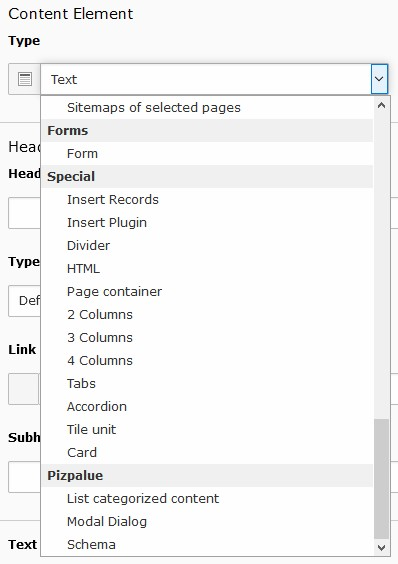
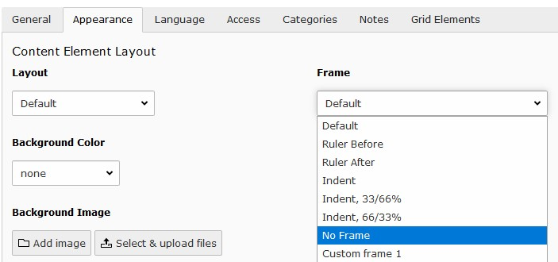

.. include:: ../Includes.txt

.. _user_use_elements:

======================
Use container elements
======================

New content element wizard
==========================

Container elements can be added by the new content element wizard. The available elements can be found under the register
`Container`.

.. figure:: ../Images/User/NewContentWizard.jpg
   :width: 500px
   :alt: Container elements in new content element wizard

   Container elements are available under the "Container" tab in new content element wizard

Content element type
====================

When changing a content element type the container elements are available in the section `Special`.

   "Container element" in content element type selector

Vertical spacing
================

Sometimes structure elements are rendered with excessive vertical spacing. To reduce them `No Frame` might be
selected by the frame selector under the `Appearance`-tab.

   Select the appropriate frame to adjust vertical spacing
