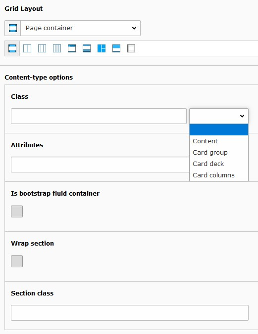
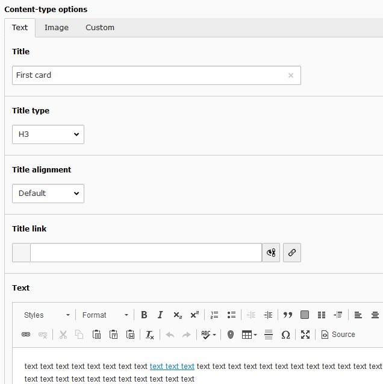
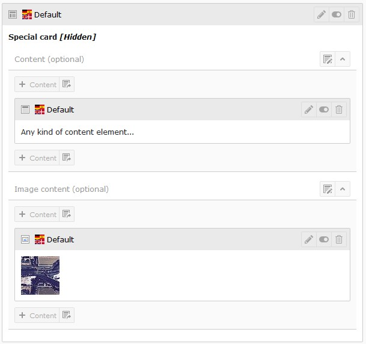
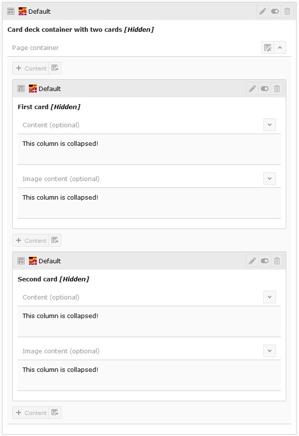

.. include:: ../Includes.txt

.. _user_adjust_elements:

====================
Adjust container elements
====================

Information regarding special features from some container elements is given below.

.. _user_adjust_container:

Container
=========

A handy element to wrap content with a `div`-tag. Optionally an additional section wrap can be added.

A container element can be combined with card elements to define the cards layout (see `layout from bootstrap's card
component <https://getbootstrap.com/docs/4.4/components/card/#card-layout>`__). Some layouts can be selected by the
container classes value picker.

   Properties from container element

.. _user_adjust_columns:

Columns
=======

Column container elements provide a register `Adjustment` allowing to control collapsing and rendering of images by
adjusting the image variants. Both features depend on the
`template pizpalue <https://extensions.typo3.org/extension/pizpalue>`__ and won't have any effect if it isn't installed.

Collapsing might be of interest to control spacing between content elements used in container elements. The settings
add related css-classes to the HTML code. Without any additional css definitions these settings don't have any visual
effects.

`Image variants` were introduced by the `bootstrap package <https://extensions.typo3.org/extension/bootstrap_package>`__
to render images with the correct properties (size, resolution, aspect ratio). The `image variants modifier stack`
provided by the `template pizpalue <https://extensions.typo3.org/extension/pizpalue>`__ extends the image variants
functionality allowing to add image variants modifications by elements such as layouts or structure elements.
As a result images in nested column container elements can be rendered with the optimal size. The feature can be
disabled globally through the typoscript constant editor or for each content element individually.

.. _user_adjust_tileUnit:

Tile unit
=========

Tile units are used to create a tile view typically showing images. Tile units aren't yet supported by the bootstrap
framework hence might not show up correctly. For the tile units to work correctly content elements might be adapted to
render with the desired tile side ratio. These content elements might be provided by an extension (e.g. the
`extension pizpalue <https://extensions.typo3.org/extension/pizpalue/>`__ provides various tile layouts for this
purpose).

Tile units might be listed or combined together. In this case it can be convenient to collect them in a container. As
well the `Frame` might need to be set to `none` in the `Appearance` tab.

.. figure:: ../Images/Introduction/TileUnit.jpg
   :width: 500px
   :alt: Tile unit

   Tile unit showing tiles

.. tip::

   A tile unit is basically a column with specific settings. You might use as well columns container elements
   (e.g. 3 Columns) and set the related parameters manually.

.. _user_adjust_card:

Card
====

The card container element can render most card layouts as outlined on the `bootstrap framework page
<https://getbootstrap.com/docs/4.4/components/card/>`__.

.. _user_card_content:

Defining content
----------------

Texts and an image can be defined through the content element's form and/or by adding any kind of content element
to the available grid containers `Content (optional)` and `Image content (optional)`.

   Text and image content defined in the card form

-----------------------------------------------------------------------------------------------------------------------

   Any kind of content element to be used as image and body content

.. _user_card_container:

Using container
---------------

Cards might be grouped with container elements.

   Two cards in a container
