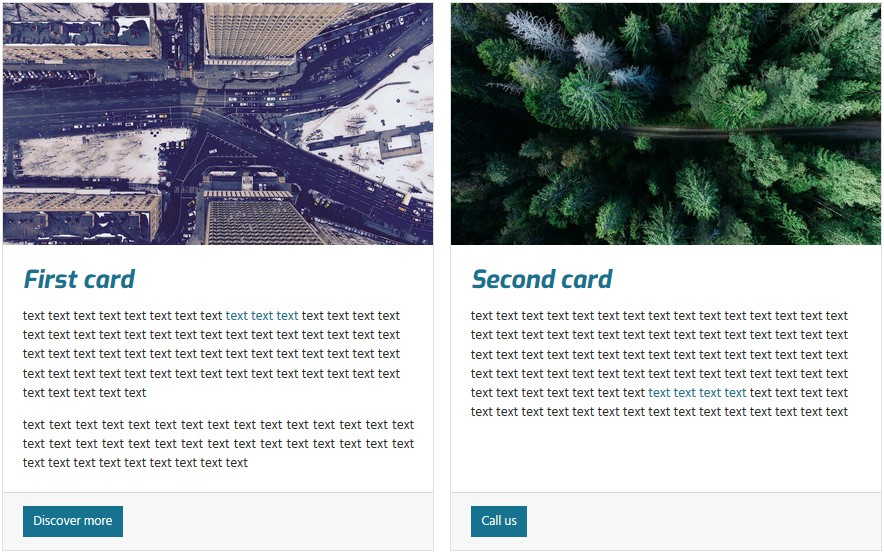
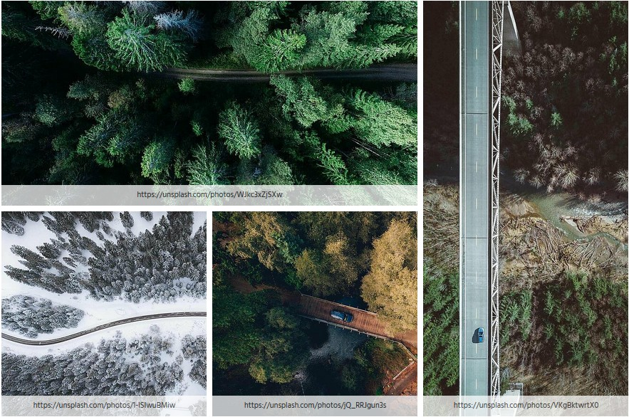

========================
TYPO3 container_elements
========================

This extension provides elements to further structure the content area. It is powered by the
`extension container <https://extensions.typo3.org/extension/container/>`__. Many thanks to the
`b13.com <https://b13.com/>`__!

Currently the following elements are available: container, columns, registers, accordion, tile unit, card and
randomizer. The extension is intended to be used together with the `bootstrap framework <https://getbootstrap.com/>`__.

Since the elements are provided by `container <https://extensions.typo3.org/extension/container>`__ they are
following referred to as container elements.

Container elements can hold any kind of content elements hence as well other container elements.

Limitations
===========

When using images in container elements reducing the horizontal space (e.g. column elements) the image dimensions
should be adapted to the resulting space. The approach to obtain the final space depends on the context and therefore
no general solution can be offered. The `template pizpalue <https://docs.typo3.org/p/buepro/typo3-pizpalue/master/en-us/>`__
offers a flexible way to optimize image dimensions in structure elements and is fully supported by this extension.
An example can be found under `pizpalue.buechler.pro <https://pizpalue.buechler.pro/das-plus/strukturelemente/container/spalten>`__.

Example contents
================

Columns, tabs and accordion
---------------------------

The following image shows the usage from a two columns container element containing a tabs container element in the left column
and an accordion container element in the right column. Three and four columns container elements are available too.

.. figure:: Documentation/Images/Introduction/ColumnsTabsAccordion.jpg
   :alt: Two columns with a tabs and accordion element

Container and cards
-------------------

The container container element (it's not a typo since the container element is a dedicated container...) adds freedom
in designing the layout. It might be used to group elements as well as to enhance the functionality. In the below shown
image the `Classes` field from the container element `container` has been set to `card-deck` and accommodates two card
container elements.

Tile unit
---------

The tile unit container element can be used to create panels showing tiles.

Tiles aren't yet supported by the bootstrap framework hence on bare installations won't show up as expected. To get
started using tile units the `extension pizpalue <https://extensions.typo3.org/extension/pizpalue>`__ might be
checked out.

Code quality
============

.. image:: https://github.com/buepro/typo3-container_elements/workflows/CI/badge.svg
   :alt: Continuous Integration Status
   :target: https://github.com/buepro/typo3-container_elements/actions?query=workflow%3ACI

Documentation
=============

Head over to `docs.typo3.org <https://docs.typo3.org/p/buepro/typo3-container-elements/master/en-us/>`__.
